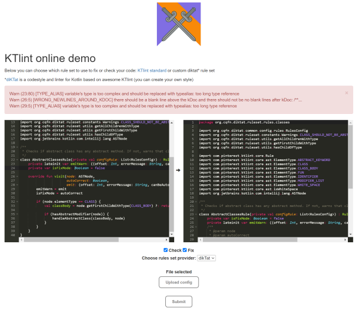

**What is the diKTat?**

Diktat - is a linter for Kotlin, but is not only a set of inspections that can can be used for **detecting** and **autofixing** code smells in CI/CD process. Diktat also is a strict [**coding standard**](https://github.com/cqfn/diKTat/blob/master/info/guide/diktat-coding-convention.md) for Kotlin that has suggestions for Kotlin developers on how to write good, clear code.

Now diktat was already added to the lists of [static analysis tools](https://github.com/analysis-tools-dev/static-analysis) and to [kotlin-awesome](https://github.com/KotlinBy/awesome-kotlin) and we receive help from the community (testing/PRs), but anyway we need your help to make Kotlin code in the world more clear.

**Why should I use diktat in my CI/CD when I have** [ktlint](https://github.com/pinterest/ktlint) **and** [detekt](https://github.com/detekt/detekt)**?**

First of all - actually you can combine diktat with any other static analyzers. And diktat is even using ktlint-framework for parsing the code into the AST.And we are trying to contribute to those projects. But the main features of diktat are the following:

1. it has more inspections. It has 100+ inspections that are tightly coupled with it's codestyle.
2. it has unique inspections that are missing in other linters
3. it is highly configurable: each and every inspection can be configured and suppressed from the code or from the configuration file
4. it has a strict detailed coding convention that you can use in your project

**I want more details about the difference between static analyzers for Kotlin - do you have any?**

Yes, I have!

**About ktlint.**

Ktlint is a popular an anti-bikeshedding Kotlin linter with built-in formatter created by pinterest. It tries to capture (reflect) official code style from kotlinlang.org and Android Kotlin Style Guide and then automatically apply these rules to your codebase. Ktlint checks and can automatically fix code and it claims to be simple and easy to use. Ktlint has been developing since 2016 and from then on it has 3.8k stars, 299 forks and 390 closed PRs (at least on the moment of writing this article). There have been written over 15k lines of code. Ktlint has it’s own ruleset, which divides on standard and experimental rules. Ktlint can be used as a plugin via Maven or Gradle. To configure rules in Ktlint you should modify .editorconfigfile. But you **can’t configure specific rules**, instead you can provide some common settings. In other words, ktlint has a ”fixed hardcoded” codestyle that is not very configurable. Properties should be specified under \[\*.kt,kts\]. If you want to implement your own rules you need to create a ruleset. Ktlint is using java’s `ServiceLoader` to discover all available ”RuleSets”. `ServiceLoader` is used to inject your own implementation of rules for the static analysis. In this case ktlint becomes a third-party dependency and a framework. Basically you should provide implementation of `RuleSetProvider`interface. Ktlint refers to article on medium on how to create a ruleset and a rule. Ktlint is very useful as a framework for creating your own checker&fixer of Kotlin code.

**About detekt.**

Detekt is a static code analysis tool. It operates on an abstract syntax tree (AST) provided by Kotlin compiler and, on top of that, it does a complex analysis of the code. However, this project is more **focused on checking** rather than fixing. Similarly to ktlint, it has it’s own rules. Detekt uses wrapped ktlint to redefine rules as it’s formatting rules. Detekt supports such features as code smell analysis, highly configurable rule sets, IntelliJ integration, third-party integrations for `Maven`, `Bazel` and Github actions, mechanism for suppression of their warnings with `@Suppress`annotation and many more. It is being developed since 2016 and today it has 3.2k stars, 411 forks and 1850 closed PRs. It has circa 45k lines of code. Detekt is very useful as a Kotlin static analyser for CI/CD.

**About ktfmt**

Ktfmt is a program that formats Kotlin code, based on google-java-format. It’s development has started in Facebookin the end of 2019. It can be added to your project through a Maven dependency, Gradle dependency, IntelliJ plugin or you can run it through a command line. Ktfmt is not a configurable application, so to change any rule logic you need to download the project and redefine some constants. Ktfmt has 214 stars, 16 forks, 20 closed PRs and around 7500 lines of code.

**About diKTat**

Diktat as well as ktlint and detekt is a static code analysis tool. But diktat is not only a tool, but also coding convention that in details describes all the rules that you should follow when writing a code on Kotlin. It’s development has started in 2020 and at the time of writing this article diKTat has 146 stars and 12 forks. DiKTat operates on AST provided by kotlin compiler. So why diKTat is better? First of all, we support much more rules than ktlint. It's ruleset includes **more than 100 rules**, that can both check and fix your code. Second, **diKTat is configurable**. A lot of rules have their own settings, and all of them can be easily understood. For example, you can choose whether you need a copyright, choose a length of line or you can configure your indentations. Third, diKTat is very easy to configure. You don’t need to spend hours only to understand what each rule is doing. Our ruleset is a `.yml` file, where each rule is commented out with the description. Last but not the least, diKTat can be used as a CI/CD tool in order to avoid merging errors in the code. Overall it can find code smells and code style issues. Also it can find pretty unobvious bugs by complex AST analysis. Diktat works with `maven`, `gradle` and as command-line application powered by ktlint.

**A few words about Jetbrains**

Jetbrains created one of the best IDEs for Java and Kotlin called IntelliJ. This IDE supports a built-in linter. However it is not a well-configurable tool, you are not able to specify your own coding convention and it **is not useful for CI/CD** as it is highly coupled with UI. Unfortunately such static analysis is not so effective as it cannot prevent merging of the code with bugs into the repository. As experience shows - many developers simply ignorethose static analysis errors until they are blocked from merging their pull requests. So it is not so suitable for CI/CD, but very good for finding and fixing issues inside your IDE.

**I don't want to install Diktat, can I try it somehow?**

Yes, you can use online demo that we have created for both diktat and ktlint here: [https://ktlint-demo.herokuapp.com/demo](https://ktlint-demo.herokuapp.com/demo)

You will not even need to install or download diktat.